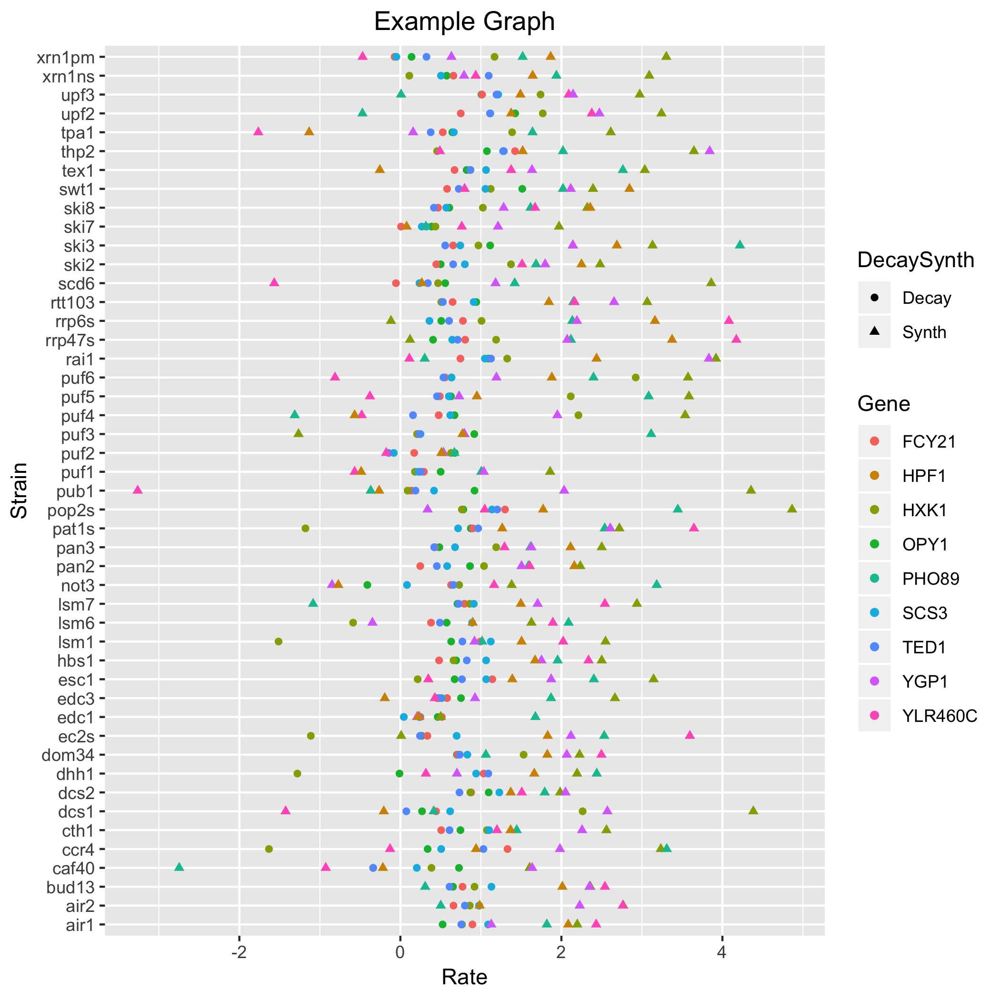

# 2019MotifHonoursProject
Code and resources compiled together as part of the Jan 2019 honours student project on predicting the effects of 3'UTR motifs

Please make sure you have installed the R programming language, its exceptionally useful IDE Rstudio and the sanity saving version control software git. (Plus send me your github account usernames so I can add you as collaborators)

https://www.r-project.org

https://www.rstudio.com

https://git-scm.com

## Getting Started
First off let us make sure git and Rstudio are correctly installed (and than we can talk about what they do!).

Open a terminal and use the cd command to move to a suitable folder for all future honours project work (i.e. a place regularly backed up). Familiarity with the UNIX commandline is assumed, please see http://www.ee.surrey.ac.uk/Teaching/Unix/ for a tutorial otherwise.

Towards the top right of this page is the clone or download button, click there and copy the URL.

Type the code below with the copied URL inserted and enter.

```bash
git clone <repository url>
```

Hopefully the command will run smoothly and you can cd to the new 2019MotifHonoursProject folder on your local machine.

If you have got this far git appears to be working correctly. Now lets try R and Rstudio! 

Open the babySteps.R file either via the terminal with the code below or however you choose to open Rstudio.

```bash
open -a Rstudio ./src/babySteps.R
```
Go to the code tab in Rstudio, then run region and run all. (If this works try looking into the keyboard shortcuts for running the code for future use).

We can now relatively safely say R, Rstudio and git are running nicely.

## Git and Rstudio

Let's start with Rstudio.

Rstudio is an example of an integrated development environment or IDE. You don't need it to program in R, you could in fact open notepad and type away without ever thinking about Rstudio. Unfortunately managing variables, debugging and package management would just be a massive pain. IDEs, ubiquitous to all programming languages in one form or another, contain a suite of tools which make progamming easier and believe me we already have plenty to think about.

Git, on the other hand, is a piece of version control software. It is a log of all the changes made to a set of files since the last time git was ran. Regularly updating the git log will allow you to quickly return to a working version of your code when the inevitable bug appears (and highlight what has been changed). In addition, correct implimentation of modular progamming can take advantage of git's branching ability. Once a simple husk of your code is created you can produce separate branchs of the git log, each focused on different sections or extensions of the original model. Each branch can be worked on by different people, or the same person at different times. This ensures the original or master code cannot be accidentally broken by anyone at anytime because each branch has its own copy of the master file which is changed, the master file is never changed. Git's genius lies in the merging software it contains which allows for seamless integration of different branching archs once they reach completion. Finally, pair git with github (using an online repository rather than a local one) and you get a powerful tool encouraging open source programming, collaboration, regular backups and near-limitless distribution. Only after the painful discovery of a catastrophic programming error will the importance of git dawn on you!

### Introductory Task

Following [this](https://guides.github.com/activities/hello-world/) tutorial and using [this](https://www.atlassian.com/git/tutorials/atlassian-git-cheatsheet) git code cheatsheet

1. Create a new branch for your local copy of this git repository, name it something like \<yourname\>GitTest
2. Create a new R file, write a short program consisting of a function that will add two arguments together with an example of it being called
3. Commit this new file to git and push it back to my online github repo
4. Now merge your newly created branch with the master and push to your own github repo!

Meanwhile, https://www.tutorialspoint.com/git/git_basic_concepts.htm will tell you more than you could ever want to know about git

## Getting used to data manipulation and plotting

To begin, make sure you have the following packages installed!
```R
install.packages(tidyverse)
install.packages(ggplot2)
```

These two packages contain many of the fundamental functions of data manipulation. Unfortunately, data is normally poorly formated and some functions can be very specific about the structure of its arguments. tidyverse combines tonnes of useful ways of manipulating tables into different shapes, repeating functions over groups of elements and making your code more read friendly. Start to familiarise yourself with tidyverse by going through the [basic](https://ourcodingclub.github.io/2017/03/20/seecc.html) and [advanced](https://ourcodingclub.github.io/2018/03/06/tidyverse.html#tidyverse) tutorials on the UoE's very own [ourcodingclub](https://ourcodingclub.github.io/tutorials/) website.

Another useful skill is to be able to plot informative, journal ready graphs, ggplot2 is a great way of doing this. the 'gg' of ggplot2 stands for grammar of graphics which refers to a [book](https://link.springer.com/book/10.1007/0-387-28695-0) outlining a logical way of organising graphs. This has developed into a highly versatile program, which although seemingly clunky at first, can rapidly create awesome graphs and dig you out of sticky situations. Again, [ourcodingclub](https://ourcodingclub.github.io/tutorials/) has wonderful tutorials on it. Start [here](https://ourcodingclub.github.io/2017/01/29/datavis.html) then move to [this](https://ourcodingclub.github.io/2017/03/29/data-vis-2.html).

### Task 1: Tidyverse Tutorial
Thankfully for you (but mainly for me), a summer stundent named Alex cleared up a lovely datset from Sun et al 2013 for you guys to use. Pull down the latest version of this repo and lets get started! Try to complete all the different sections of this task in one file, using git to manage the next version as you finish one task and move onto the next. 

1) Import the decay rate data dr_data.csv and synthesis rate data sr_data.csv from the ./data folder
2) Create code to calculate the mean decay/synthesis rates for each gene across all of its mutants.
3) Can you create a single table of genes who have at least one mutant with a significantly changed decay rate or synthesis rate? Can you get it to record the number of significant mutants for each gene?
4) Make another table with one row per gene but with the logfold decay/synthesis rates across all mutants along the columns
5) Plot a ggplot2 graph (with legend, x/y labels and title) of logfolds across all mutants for the top 5 genes with the highest mean synthesis/decay rates. Ensure the genes are colour coded!

## String Searching 
Rather obviously, huge swaths of data are stored in the versatle yet disordered string variable type. Compared to matrices of numbers, whose indices uniquely map elements with logically traceable relationships, strings tend to be massive dumps of various variable types and explanatory comments. In essence, strings are vital for human understanding but entirely intractable for computers. A fair amount of data analysis tasks revolve around slicing exceptionally long strings into computer edible chunks for further analysis. You could create painfully complex logic expressions with numerous nested for/if/while loops to account for every conceivable mispelling or capital letter. Or fortunately for us, we can familarise ourselves with the relatively universal syntax for searching for common structure and their similar variations in strings. 

Regex (or regular expressions) are available, in some form, for all programming languages. They allow you to outline specific patterns (such as an individual words) together with allowed variants (such as misspelling or cultural varitions or ignoring capitalisation) and even more complex local environment conditions (such as only after a full stop or newline). The underlying algorithms then produce and execute the required logic (very often in a more efficient manner then you could possible have done). 

```R
library(stringr)

# Search for the two spellings of aluminium
regex("alumin(|i)um")

str <- "Is it aluminium or aluminum!"
str_extract_all(str,regex("alumin(|i)um"))
```

Please go through [R for Data Science's](https://r4ds.had.co.nz/strings.html#introduction-8) tutorial on regex for a more complete overview.

### Task 2: Regex Tutorial

1) Import the txt file holding S.cerevisiae chromosome 7 from the ./data folder
2) How many times does the TGTTGGAATA motif arise in the chromosome?
3) What is most common base pair after/before this motif?
4) Can you create a search to look for single nucleotide mutant of this motif?
